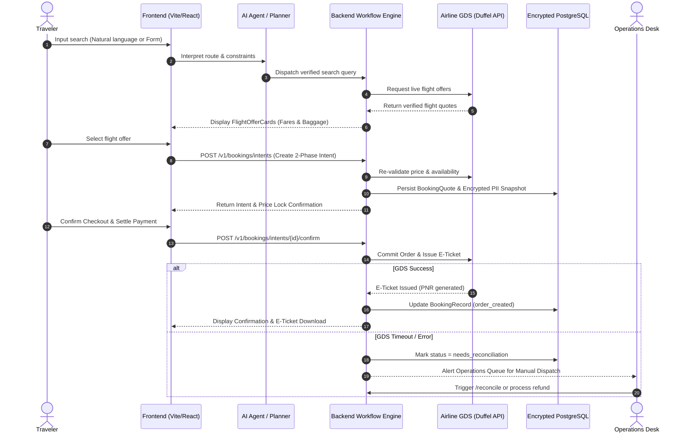

# Full OTA Product Specification & Supplier Integration Guide

**Document Type:** Business Requirements Document (BRD) & Operations Blueprint  
**Product:** Multi-Agent Full OTA Flight Booking Platform (Domestic & International)  
**Target Market:** Vietnam & Southeast Asia (Domestic & International Global Routes)  
**Architecture:** Multi-Agent Orchestration (LangGraph), GDS API Integration (Duffel / Amadeus / Sabre), PII AES-GCM-256 Encryption, Two-Phase Booking Intents, and Dedicated Operations Service Desk.

---

## 1. Executive Summary & Product Objective

The objective of this platform is to build a full-fledged Online Travel Agency (OTA) that empowers users to search, compare, book, and settle airfares for both **domestic (Vietnam)** and **international** flight routes seamlessly without third-party redirects.

The platform combines conversational AI natural-language planning with deterministic airline distribution contracts, guaranteed price re-validation, idempotent payment commits, and a dedicated internal operations console for exception handling and after-sales servicing.

---

## 2. MVP Scope vs. Future Roadmap

```text
+---------------------------------------------------------------------------------------+
|                                    OTA ROADMAP SCOPE                                  |
|                                                                                       |
|  [PHASE 1 - MVP: LIVE & VERIFIED]                                                     |
|  ├── One-way & Round-trip Search (300+ Airlines via GDS & Domestic Aggregators)       |
|  ├── Real-time Fare, Baggage, & Fare Rules Transparency                               |
|  ├── AES-GCM-256 Encrypted Traveler Passport & Identity Management                    |
|  ├── 2-Phase Booking Intent & Idempotent Payment Checkout Flow                        |
|  ├── Automated E-Ticket Issuance & Confirmation Routing                               |
|  ├── After-Sales Servicing Hub (Cancellation & Reschedule Requests)                   |
|  └── Internal Operations Desk (`/operations`) for GDS Reconciliation & Exception Logs |
|                                                                                       |
|  [PHASE 2 - ADVANCED SCALING]                                                         |
|  ├── Direct NDC (New Distribution Capability) Airline API Direct Connects             |
|  ├── Deep Ancillaries (Automated Seat Selection, Extra Baggage, Travel Insurance)     |
|  ├── Automated Self-Service Refund Settlement & Instant GDS Voiding                   |
|  └── Airline Schedule Change Webhook Automation                                       |
+---------------------------------------------------------------------------------------+
```

---

## 3. Core Value Proposition

1. **Direct In-App Booking (No Redirects):** Complete flight selection, passenger data entry, and payment occur directly inside the platform.
2. **Deterministic Price Re-Validation:** Live re-pricing before payment capture eliminates surprise fare discrepancies.
3. **Transaction Safety & Idempotency:** Financial transactions utilize UUID idempotency keys to prevent duplicate bank charges or ghost bookings.
4. **Comprehensive After-Sales Support:** Clear pathways for refund claims, date changes, and airline schedule change handling.
5. **Internal Operations Tooling:** An internal service desk (`/operations`) provides real-time transaction tracing, carrier status reconciliation, and manual override capabilities.

---

## 4. End-to-End User & System Flow



---

## 5. Exception Handling & Risk Matrix

| Exception Scenario | Root Cause | System Defense & Mitigation | Ops Intervention |
| :--- | :--- | :--- | :--- |
| **Fare Changed / Expired** | Airline inventory dynamic yield management update | Pre-checkout quote re-verification (`PriceDiscrepancyError`, `OfferExpiredError`) blocks outdated checkout. | Prompt user with updated fare; no money captured. |
| **GDS Timeout After Payment** | Network lag during GDS ticketing | Two-phase commit marks order as `needs_reconciliation` without failing transaction. | Ops Desk verifies PNR on GDS terminal and clicks **Reconcile**. |
| **Duplicate Booking Risk** | User double-clicking or network retries | Cryptographic `idempotency_key` enforced at database layer. | Deduplicated automatically at API gateway. |
| **Invalid Passenger PII** | Typo in passport number or name order | Regex & IATA passport completeness validator (`TravelerProfileService`). | Form validation highlights missing fields before booking. |
| **Airline Schedule Change** | Carrier operational schedule adjustment | After-Sales Service Hub receives reschedule claim with PNR reference. | Ops Desk contacts carrier to rebook free of charge. |
| **Cancellation / Refund** | Traveler plan changes or visa denial | In-app **Request Refund** modal logs structured case with reason. | Ops Desk calculates carrier refund penalty and returns net amount. |

---

## 6. Key Performance Indicators (KPIs) & SLAs

- **Search-to-Booking Conversion Rate:** Target $\ge 3.5\%$
- **Payment & Checkout Success Rate:** Target $\ge 99.2\%$
- **GDS Auto-Ticketing Rate:** Target $\ge 97.0\%$
- **Average Error Handling Time (AHT):** $< 15\text{ minutes}$ for manual exceptions
- **Refund Turnaround Time:** $< 24\text{ hours}$ for standard non-disputed refunds
- **System API Latency:** $\le 300\text{ms}$ average response time

---

## 7. Supplier Selection Checklist & Evaluation Matrix

When selecting airline inventory aggregators and GDS partners, evaluate suppliers according to this priority checklist:

```text
1. Ticketing & Booking Reliability (Weight: 30%)
   ├── Instant E-Ticket generation latency (< 5 seconds)
   ├── Guaranteed automated voiding window (Same-day 24h void)
   └── Webhook notifications for order updates

2. Route Coverage (Weight: 25%)
   ├── Domestic Vietnam (Vietnam Airlines, VietJet Air, Bamboo Airways)
   ├── Regional ASEAN (Singapore, Thailand, Malaysia, Indonesia, Japan, Korea)
   └── Long-Haul International (US, Europe, Australia, Middle East)

3. Fare Rules & Ancillaries Data Quality (Weight: 20%)
   ├── Structured baggage piece & weight breakdown in API payload
   ├── Machine-readable cancellation & change penalty terms
   └── Seat selection and meal booking support

4. Commercial Terms & Margins (Weight: 15%)
   ├── Transparent commission structure / markup capability
   ├── Flexible settlement cycle (Weekly / Monthly invoicing)
   └── Multi-currency settlement (VND, USD, SGD)

5. Developer Experience & Support (Weight: 10%)
   ├── RESTful / JSON APIs with reliable Sandboxes
   └── 24/7 Tier-2 Developer & Operations Support
```

### Recommended Primary & Secondary Supplier Stack:
- **Global & International Aggregator:** **Duffel API / Amadeus for Developers** *(300+ Airlines, REST/JSON, instant sandboxes)*.
- **Vietnam Domestic Direct Integration:** **VietJet Direct API / Vietnam Airlines Sabre Direct Connect**.

---

## 8. Rollout Strategy

1. **Phase 1 (Current):** Launch Domestic Vietnam + Popular Regional Routes (Singapore, Thailand, Japan) with full GDS integration and active Operations Desk.
2. **Phase 2:** Introduce Direct NDC connections for low-cost carriers to maximize margin.
3. **Phase 3:** Automated self-service cancellation with instant wallet refund settlements.
